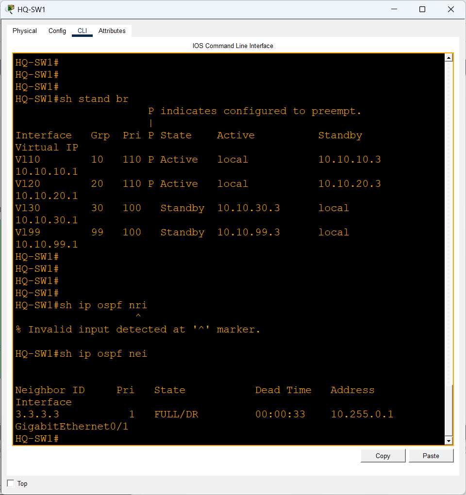
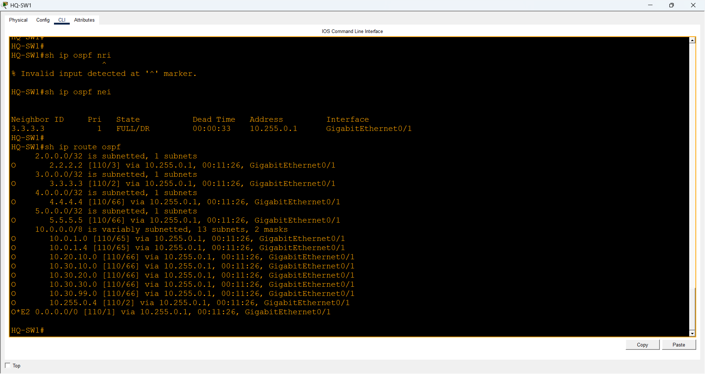
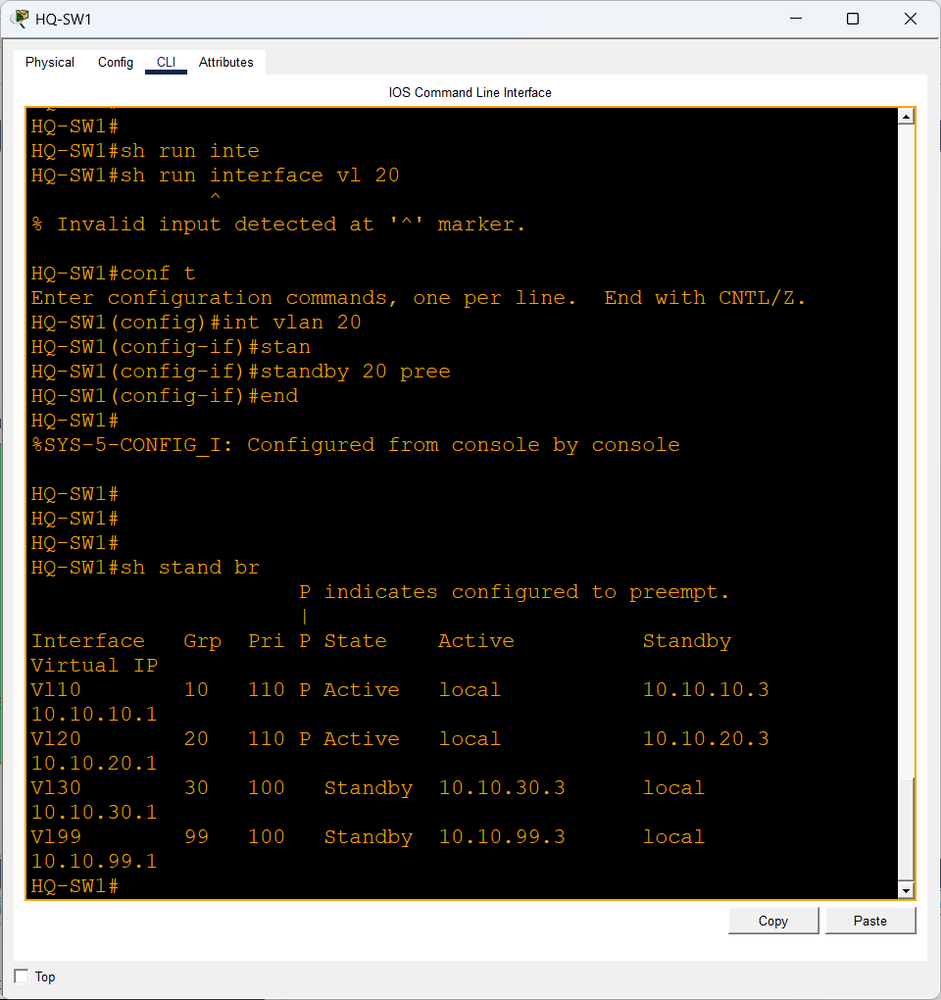
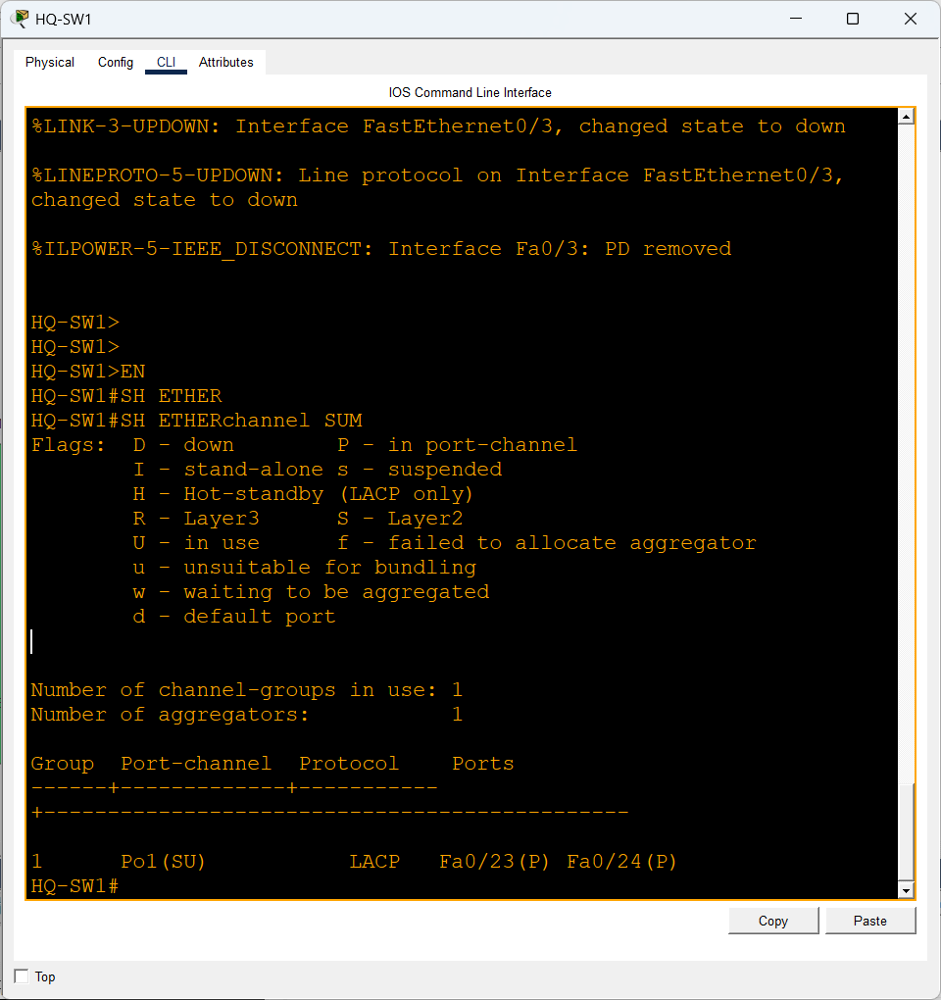
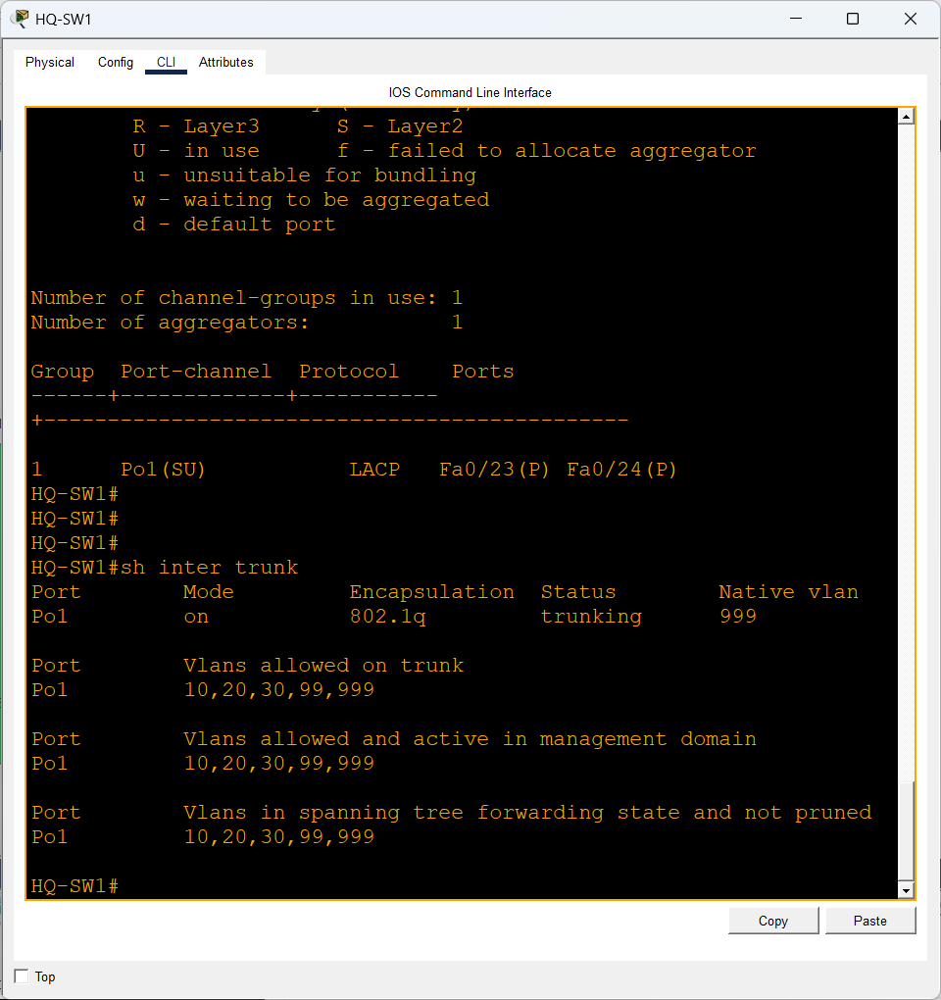
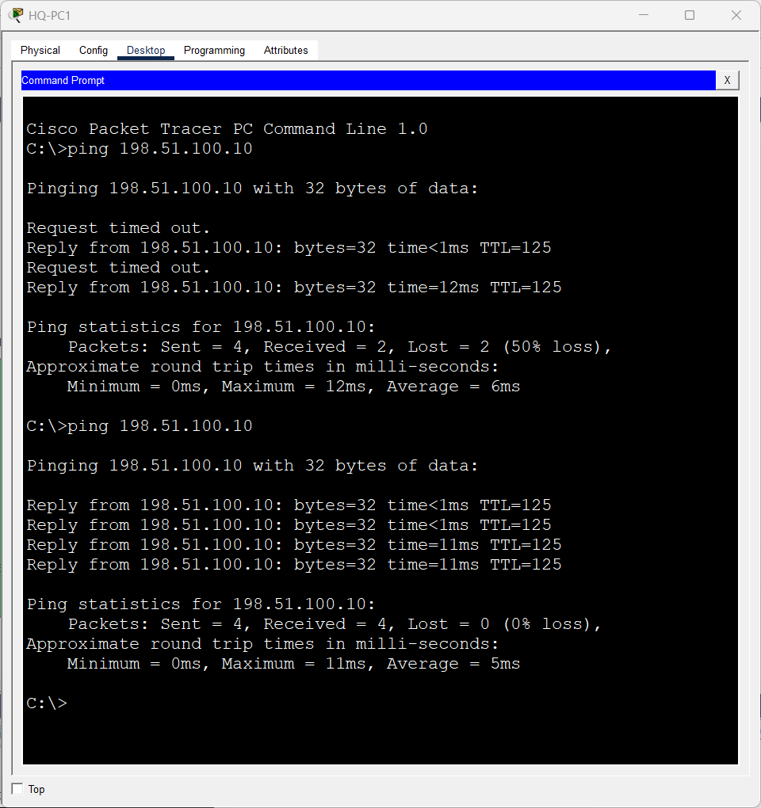
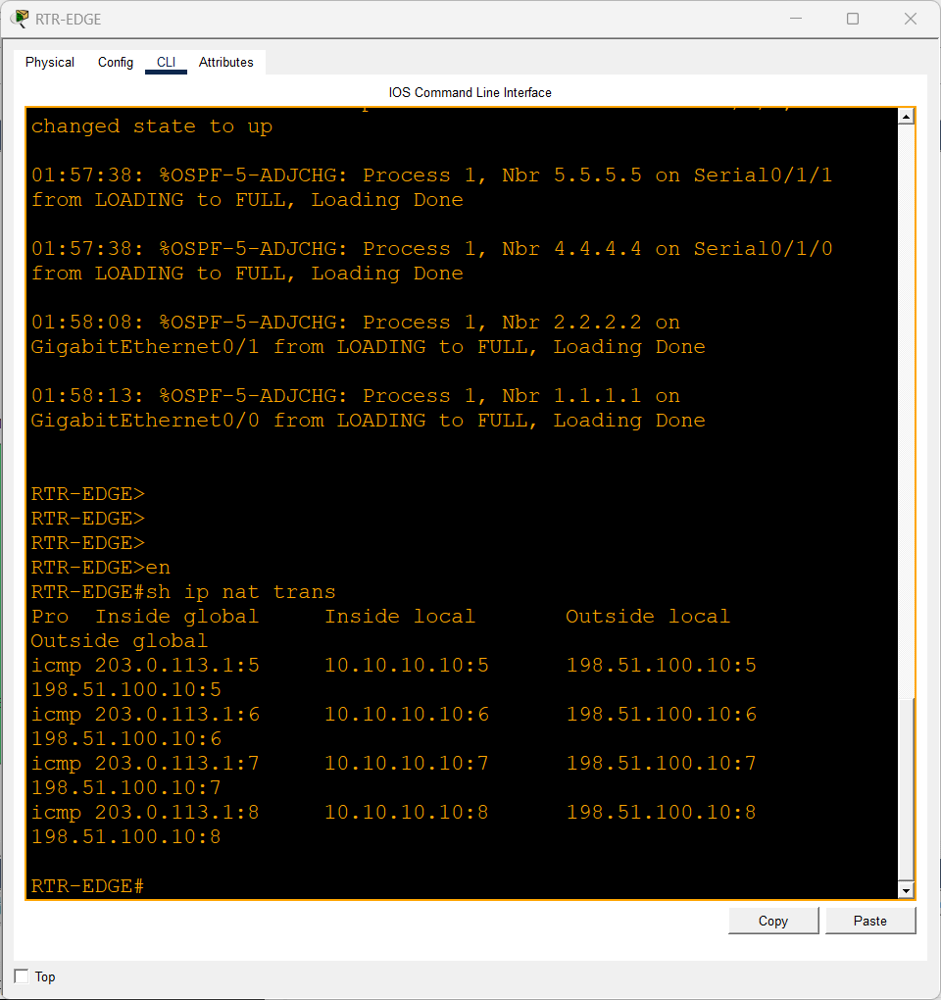
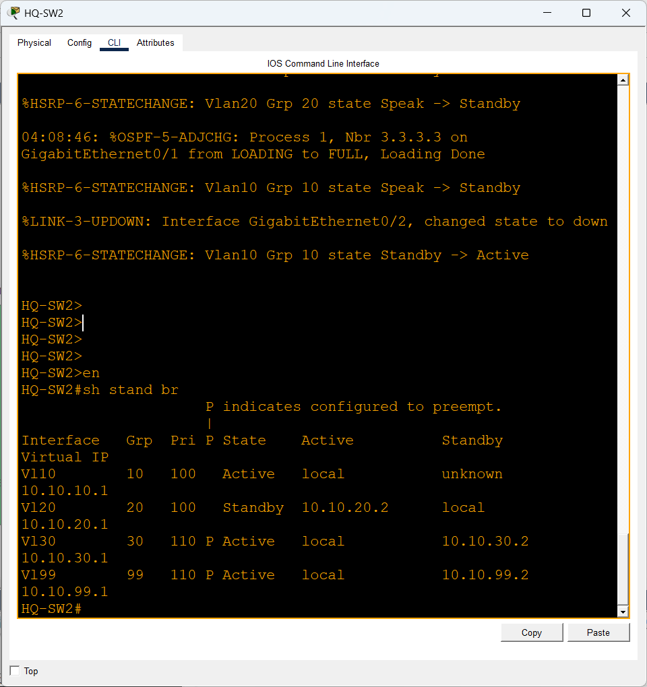
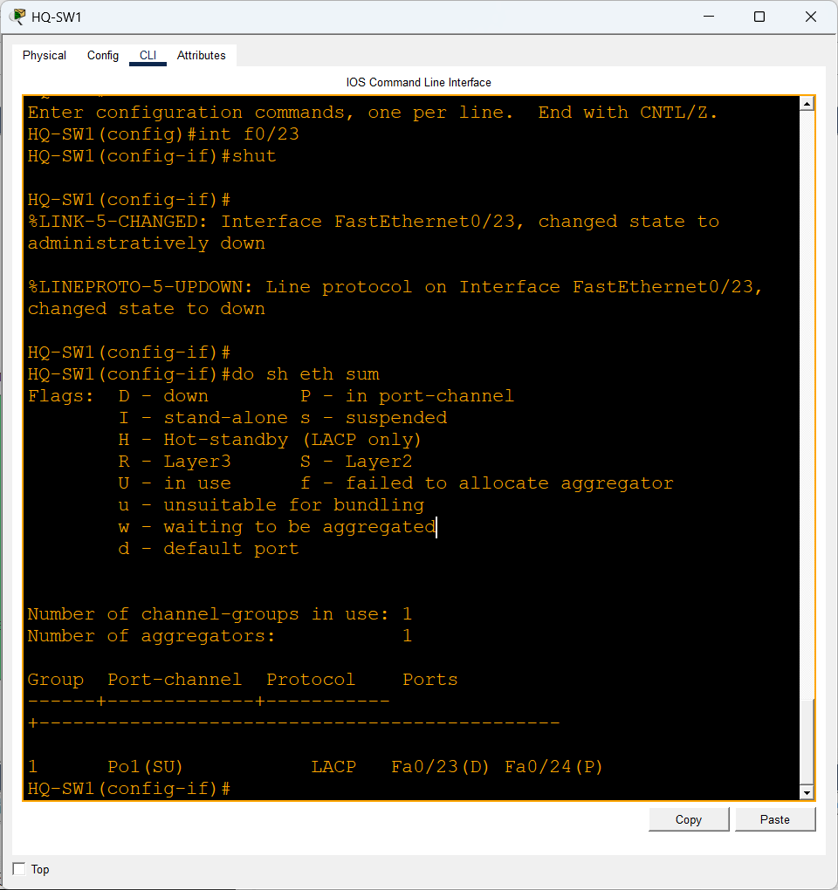

# Multi-Site Enterprise Network — From Deployment to Failure Recovery

## Overview

This project simulates a multi-site enterprise network built in Cisco Packet Tracer.

The environment includes a redundant headquarters network, two branch offices, centralized services, dynamic routing, Internet connectivity, gateway redundancy, and Layer 2 resiliency.

The goal of the lab was not only to configure the network, but also to verify normal operation, troubleshoot issues, and test how the infrastructure responds to failures.

## Network Topology

The topology consists of:

* Headquarters with two multilayer switches
* Two branch offices
* Edge router
* ISP router
* Public web server
* Centralized DHCP services
* Multiple VLANs
* Redundant switching paths


## Technologies Implemented

* VLAN segmentation
* 802.1Q trunking
* Router-on-a-Stick
* Layer 3 switching
* HSRP
* LACP EtherChannel
* Rapid-PVST
* OSPF
* DHCP
* DHCP relay
* NAT/PAT
* ACLs
* PortFast
* BPDU Guard
* Port Security
* Default route propagation

## VLAN Design

| VLAN | Purpose     |
| ---- | ----------- |
| 10   | Users       |
| 20   | Servers     |
| 30   | Voice       |
| 99   | Management  |
| 999  | Native VLAN |

## Routing

OSPF provides dynamic routing between headquarters, the edge router, and both branch locations.

The edge router also advertises a default route into OSPF, allowing internal networks to reach external destinations.





## Gateway Redundancy

HSRP provides redundant default gateways at headquarters.

HQ-SW1 is the preferred active gateway for VLANs 10 and 20.

HQ-SW2 is the preferred active gateway for VLANs 30 and 99.



## EtherChannel

HQ-SW1 and HQ-SW2 are connected using an LACP EtherChannel consisting of two FastEthernet links.

This provides additional bandwidth and redundancy between the switches.



## Trunking

The EtherChannel operates as an 802.1Q trunk carrying VLANs 10, 20, 30, 99, and 999.

VLAN 999 is used as the native VLAN.



## DHCP

Centralized DHCP services provide IP addressing to client devices.

Branch routers use DHCP relay with `ip helper-address` to forward client DHCP requests to the centralized DHCP server.

## Internet Connectivity and NAT

Internal private networks reach the simulated Internet through the edge router.

NAT/PAT translates internal private addresses to the outside-facing address of the edge router.





## Failure Recovery Testing

### HSRP Failover

To test gateway redundancy, the VLAN 10 SVI on HQ-SW1 was administratively shut down.

HQ-SW2 automatically transitioned from Standby to Active and assumed responsibility for the VLAN 10 virtual gateway.

Connectivity to the HSRP virtual IP remained available.



After HQ-SW1 was restored, its higher HSRP priority and preemption configuration allowed it to reclaim the Active role.

### EtherChannel Link Failure

One physical member of the LACP EtherChannel was manually shut down.

The port-channel remained operational using the remaining physical link.



This demonstrated that the logical EtherChannel could survive the loss of an individual member link.

## Troubleshooting Experience

Several issues were encountered and resolved during the build, including:

* Native VLAN mismatch between trunk links
* Branch clients receiving APIPA addresses
* DHCP relay configuration
* OSPF adjacency and route propagation
* NAT initially showing no translations
* Verifying traffic paths between internal and external networks
* HSRP preemption configuration
* EtherChannel redundancy validation

Troubleshooting these issues helped reinforce the importance of verifying Layer 1 through Layer 3 connectivity systematically rather than assuming the problem exists at a specific layer.

## Verification Commands

Some of the commands used to validate the network included:

```text
show etherchannel summary
show interfaces trunk
show spanning-tree
show standby brief
show ip ospf neighbor
show ip route ospf
show ip nat translations
show ip nat statistics
show ip interface brief
```

## Configuration Files

Full running configurations for the routers and switches are included in this repository:

* `HQ-SW1.TXT`
* `HQ-SW2.TXT`
* `RTR-EDGE.TXT`
* `RTR-BR1.TXT`
* `RTR-BR2.TXT`
* `SW-BR1.TXT`
* `SW-BR2.TXT`

The completed Cisco Packet Tracer topology is also available as `multi-site-enterprise-network.pkt`.

## What I Learned

This project helped strengthen my understanding of how individual CCNA technologies work together in a larger enterprise design.

Rather than configuring each technology in isolation, I had to understand how switching, routing, gateway redundancy, DHCP, NAT, and WAN connectivity affected the complete traffic path.

The failure testing was particularly valuable because it demonstrated the difference between simply configuring redundancy and verifying that redundancy actually works.

## Tools

* Cisco Packet Tracer
* Cisco IOS CLI
* GitHub
